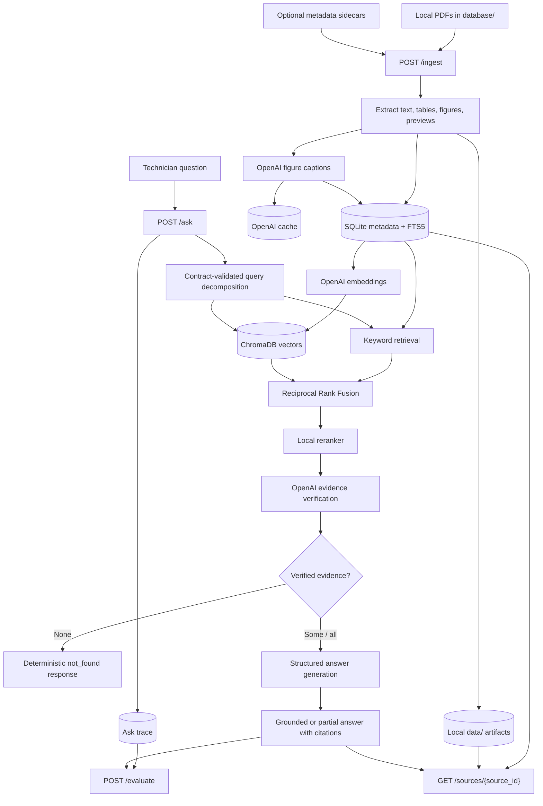

# Multimodal RAG

Prototype for grounded troubleshooting answers from locally loaded technical manuals.

## V1 Process Flow



1. Place public digital PDFs in `database/`, optionally with matching metadata sidecars.
2. Run ingestion to extract citeable source elements, create previews, and index searchable chunks.
3. Store canonical metadata in SQLite, keyword search in SQLite FTS5, vectors in ChromaDB, and runtime artifacts under `data/`.
4. Answer questions through `/ask` using decomposition, hybrid retrieval, RRF, local reranking, hosted evidence verification, and structured answer generation from verified evidence only.
5. Return `grounded`, `partial`, or deterministic `not_found` responses with citations, source previews, confidence metadata, and ask traces.
6. Use `/retrieve`, `/sources/{source_id}`, and `/evaluate` to inspect retrieval, evidence, previews, and rubric scoring independently.

## Python Environment

```powershell
uv sync
uv run pytest
uv run ruff check .
uv run mypy .
```
